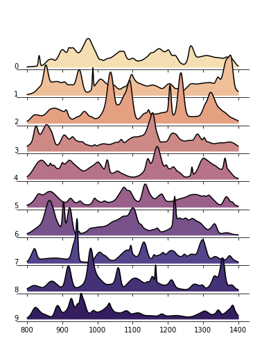

# Example data

This folder contains several sources of example Raman spectroscopy data useful for testing. The data is organized into separate subfolders based on the instrument they were acquired with. The synthetic data was generated 

### Directory tree
```
─ Horiba
  ├── LabRAM
  │   ├── CC-124_TAP_532nm.txt
  │   └── acetonitrile_473nm.txt
  └── MacroRAM
      ├── CC-124-TAP.txt
      ├── CC-125-TAP.txt
      ├── CC-1373-TAP.txt
      └── polystyrene.txt
─ OpenRAMAN
  ├── 2024-10-04_CC-124-TAP_n_n_solid_10000_0_5.csv
  ├── 2024-10-04_CC-125-TAP_n_n_solid_10000_0_5.csv
  ├── 2024-10-04_CC-1373-TAP_n_n_solid_10000_0_5.csv
  ├── 2024-10-04_Wardscalcite_n_n_solid_1000_0_5.csv
  ├── 2024-10-04_acetonitrile_n_n_solid_10000_0_5.csv
  ├── 2024-10-04_neon_n_n_solid_10000_0_5.csv
  └── calibration_data
      ├── 2024-08-20_acetonitrileinquartzcuvette_n_n_solid_500_0_5.csv
      ├── 2024-08-20_neon_n_n_solid_1000_0_5.csv
      ├── ...
      ├── 2024-10-29_acetonitrile-control_n_n_n_solid_10000_0_5.csv
      └── 2024-10-29_neon-control_n_n_n_solid_1000_0_5.csv
─ Renishaw
  ├── CC-125_TAP_multipoint.txt
  └── CC-125_TAP_singlepoint.txt
─ Wasatch
  └── acetonitrile.csv
─ synthetic_data
  ├── fake_spectrum_0.txt
  ├── ...
  └── fake_spectrum_9.txt
```


### Horiba
Contains several spectra polystyrene, acetonitrile, and three different strains of *Chlamydomonas* (marine algae) cell cultures acquired by the [Horiba MacroRAM](https://www.horiba.com/usa/scientific/products/detail/action/show/Product/macroramtm-805/) and [Horiba LabRAM](https://www.horiba.com/usa/scientific/products/detail/action/show/Product/labram-hr-evolution-1083/). The Horiba MacroRAM uses a 785 nm laser with power ranging from 7–450 mW, while the LabRAM had several laser wavelengths available (473 nm, 532 nm, 633 nm). Acquisition settings were the same for all samples:

Parameter | Value
-- | --
Exposure | 10 s
Num accumulations | 5
Laser power | 50 mW

The full list of acquisition settings can be found in the metadata of each file.


### OpenRAMAN
Contains several spectra of three different strains of *Chlamydomonas* (marine algae) cell cultures as well as spectra of calcite, acetonitrile, and Neon acquired by the [OpenRAMAN](https://www.open-raman.org/). The OpenRAMAN uses a 532 nm laser with ~3.5 mW power. Acquisition settings are encoded in the filename: 
```
{YYYY-MM-DD}_\
{sample name}_\
{baseline removal (y/n)}_\
{median filtering (y/n)}_\
{cuvette type (solid/liquid)}_\
{exposure (ms)}_\
{gain}_\
{num avg}.csv
```
All files were acquired with the solid cuvette for 10 s and averaged over 5 acquisitions with no median filtering or baseline subtraction applied.

This folder also contains 34 files of calibration data, comprised of 17 pairs of neon and acetonitrile spectra measured with various acquisition settings between August and October 2024. The neon spectra serves as the broadband excitation light source for the rough calibration, while the acetonitrile spectra serves as the Raman-scattered light from a known reference for the fine calibration.


### Renishaw
Contains spectral data from one single-point measurement and one multipoint measurement of one strain of *Chlamydomonas* (marine algae) cell cultures acquired by the [Renishaw Qontor](https://www.renishaw.com/en/invia-confocal-raman-microscope--6260?srsltid=AfmBOooiKo_pI7dx9z-CQavJXivfP0KPDkhLiVhLkZwlbUbagLsJA3d2). The multipoint acquisition was truncated to only include 4 positions at arbitrary locations within the petri dish. Acquisition settings were the same for all samples:

Parameter | Value
-- | --
Wavelength | 785 nm
Exposure | 10 s
Num accumulations | 5
Laser power | 300 mW


### Wasatch
Contains spectral data from one measurement of acetonitrile acquired by the [Wasatch WP 785X](https://wasatchphotonics.com/product/wp-785x-raman-spectrometer-series/). Acquisition settings for the acetonitrile sample:

Parameter | Value
-- | --
Wavelength | 785 nm
Exposure | 3 s
Num accumulations | 2
Laser power | 50 mW

The full list of acquisition settings can be found in the metadata of each file.


### Synthetic data
The synthetic data was generated using the `synth` module in [`RamanSPy`](https://ramanspy.readthedocs.io/en/latest/synth.html#). 10 fake spectra were generated with an (arbitrary) spectral range from 800 to 1400 cm^-1 and 512 samples per spectrum. The methodology underlying how the fake spectra are synthesized is described in [Georgiev et al. (2024)](https://doi.org/10.48550/arXiv.2403.04526).




#### Code snippet used to generate the data
```python
import numpy as np
import ramanspy

# create synthetic spectra
num_spectra = 10
num_bands = 512
spectral_axis = np.linspace(800, 1400, 512)
synthetic_spectra = ramanspy.synth.generate_spectra(
    num_spectra,
    num_bands,
    spectral_axis=spectral_axis,
    realistic=True,
    seed=37,
)

# save synthetic spectra
for i, spectrum in enumerate(synthetic_spectra):
    array = np.stack([spectrum.spectral_axis, spectrum.spectral_data]).T
    filename = f"synthetic_data/fake_spectrum_{i}.txt"
    np.savetxt(filename, array)
```

#### Code snippet used to generate the plot
```python
import arcadia_pycolor as apc  # must be installed with e.g. `pip install arcadia-pycolor`
import matplotlib.pyplot as plt  # must be installed with e.g. `pip install matplotlib`
import numpy as np

# define color palette and create figure
palette = apc.gradients.magma.reverse().resample_as_palette(len(synthetic_spectra))
fig, axes = plt.subplots(
    nrows=len(synthetic_spectra),
    sharex=True,
    sharey=True,
    figsize=(6, 8),
    gridspec_kw={"hspace": -0.5},
)

for i, spectrum in enumerate(synthetic_spectra):
    # plot spectra
    axes[i].plot(spectrum.spectral_axis, spectrum.spectral_data, color="black", alpha=1)
    axes[i].fill_between(
        spectrum.spectral_axis, 0, spectrum.spectral_data, color=palette.colors[i], alpha=1
    )
    # aesthetics
    axes[i].set_yticks([])
    axes[i].set_ylabel(i, rotation="horizontal", loc="bottom")
    axes[i].spines["left"].set_visible(False)
    axes[i].spines["right"].set_visible(False)
    axes[i].spines["top"].set_visible(False)
    axes[i].patch.set_alpha(0)

apc.mpl.save_figure("synthetic_data/synthetic_spectra_plot.png")
```
